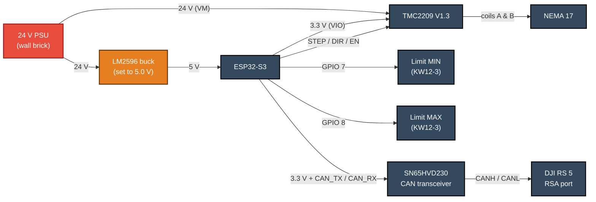
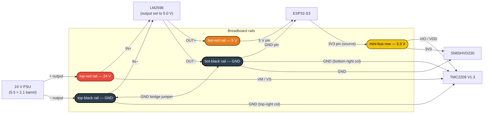
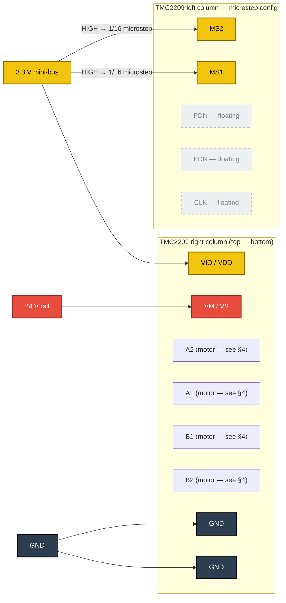
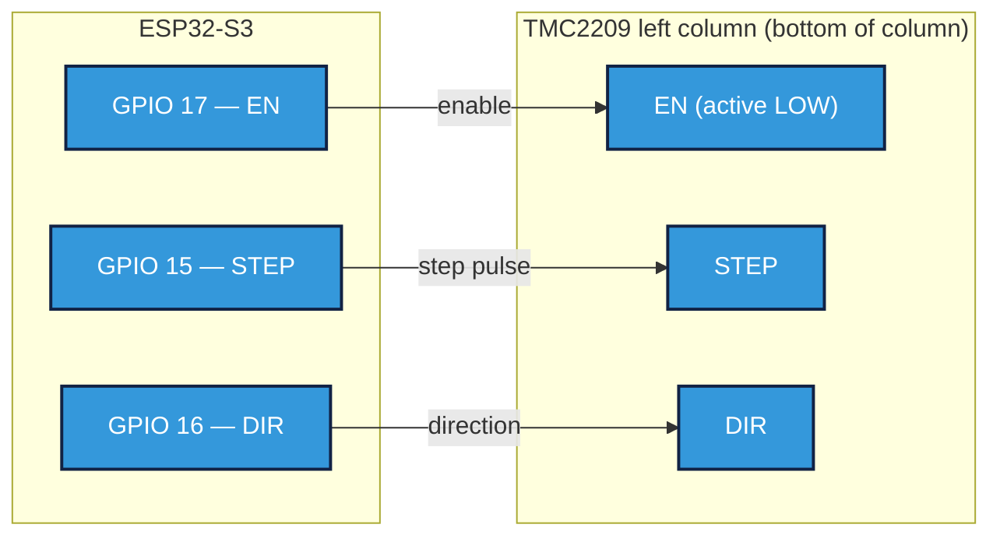
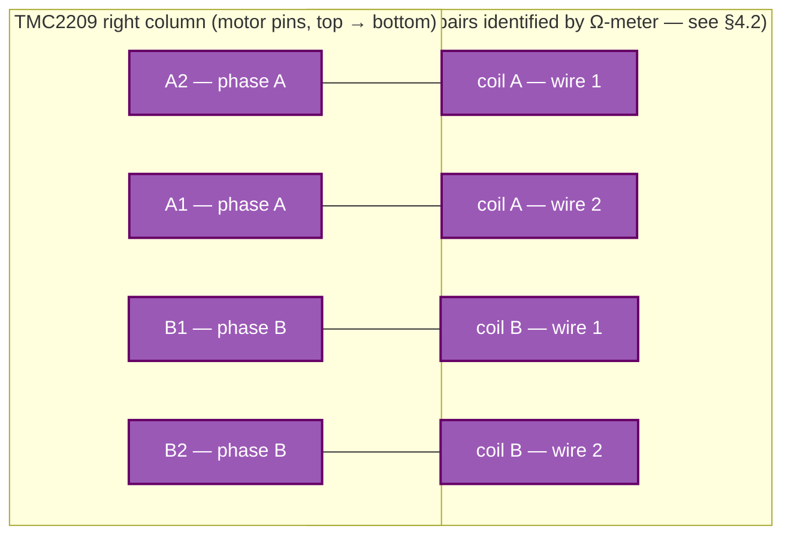
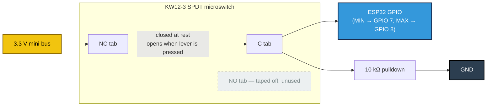
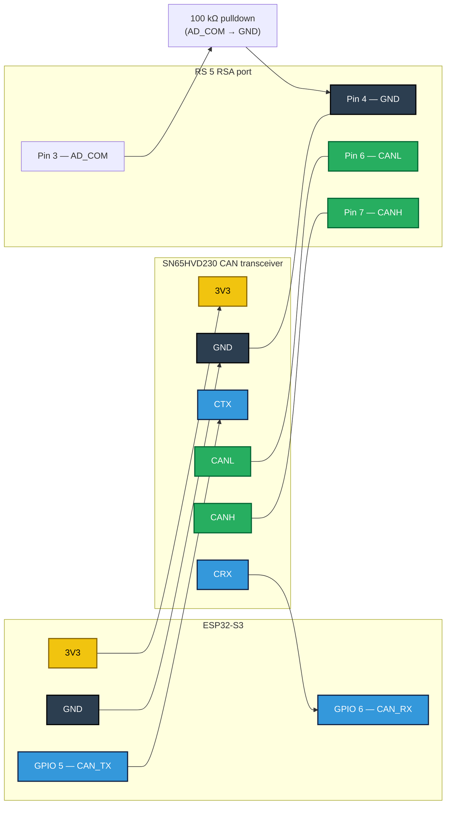

# OpenDolly Wiring

*Status: active*
*Scope: Every wire in the current build (slider axis + DJI RS 5 gimbal over CAN). Pinouts, diagrams, and connection tables — a reference document, not a bring-up procedure.*

**Subsystems covered:**

1. Power distribution (24 V PSU, LM2596 buck, rails)
2. ESP32-S3
3. Stepper motor driver (BTT TMC2209 V1.3)
4. Stepper motor (NEMA 17)
5. Limit switches (KW12-3, NC fail-safe)
6. DJI RS 5 gimbal via CAN bus (SN65HVD230 transceiver)

**Legend (applies to all diagrams):**

| Color       | Meaning                           |
|-------------|-----------------------------------|
| Red         | 24 V (motor power bus)            |
| Orange      | 5 V (ESP32 supply)                |
| Yellow      | 3.3 V (logic reference)           |
| Dark grey   | GND (single common node)          |
| Blue        | Digital signal (ESP32 GPIO)       |
| Purple      | Motor coil conductor              |
| Green       | CAN differential pair             |
| Dashed grey | Intentionally unconnected / floating |

---

## 1. Overview

### 1.1 System block diagram



### 1.2 ESP32-S3 GPIO map (current build)

Only pins that carry real signals are listed. Source of truth: [`firmware/src/config.h`](../../firmware/src/config.h).

| GPIO | Direction | Net                   | Wired to                                      |
|-----:|-----------|-----------------------|-----------------------------------------------|
|    5 | out       | `PIN_CAN_TX`          | SN65HVD230 `CTX`                              |
|    6 | in        | `PIN_CAN_RX`          | SN65HVD230 `CRX`                              |
|    7 | in (intr) | `PIN_LIMIT_MIN`       | MIN microswitch `C` (+ 10 kΩ pulldown to GND) |
|    8 | in (intr) | `PIN_LIMIT_MAX`       | MAX microswitch `C` (+ 10 kΩ pulldown to GND) |
|   15 | out       | `PIN_STEP`            | TMC2209 `STEP`                                |
|   16 | out       | `PIN_DIR`             | TMC2209 `DIR`                                 |
|   17 | out       | `PIN_EN`              | TMC2209 `EN` (active LOW)                     |
|  3V3 | out       | 3.3 V logic reference | 3.3 V mini-bus (TMC2209 VIO/MS1/MS2, SN65HVD230 3V3, limit switches NC tabs) |
|   5V | in        | 5 V supply            | LM2596 `OUT+`                                 |
|  GND | —         | common GND            | LM2596 `OUT−`, TMC2209 both `GND` pins, SN65HVD230 `GND`, pulldown resistors |

Pin 18 (`PIN_TMC_UART_*`) is defined in firmware but not wired in the current build (Phase 1 uses STEP/DIR only).

### 1.3 Global wiring constraints

These apply to the whole system, not any one subsystem:

- **VM ≠ VIO.** The TMC2209 has a 24 V motor rail (`VM`/`VS`) and a 3.3 V logic rail (`VIO`/`VDD`) on the same pin-header side. Swapping them destroys the driver and usually the ESP32 with it.
- **Single common GND.** Every subsystem's ground is the same electrical node — PSU `−`, LM2596 `OUT−`, ESP32 `GND`, both TMC2209 `GND` pins, SN65HVD230 `GND`, limit-switch pulldowns, and RSA pin 4 (and 8) all tie together.
- **Bulk capacitor on VM.** The BTT V1.3 has one on-board; if a different driver variant is substituted, add a 100–220 µF electrolytic across VM and GND close to the driver.
- **Do not connect RSA pin 1/5 (VCC, 9 V) to anything in this harness.** The gimbal exposes 9 V on those pins; the ESP32 and transceiver run on 5 V / 3.3 V from the LM2596 and would be damaged.

---

## 2. Power distribution



The 3.3 V mini-bus is a single un-used breadboard row fed from the ESP32's on-board `3V3` regulator. Everything needing 3.3 V (TMC2209 `VIO`, `MS1`, `MS2`; limit-switch `NC` tabs; SN65HVD230 `3V3`) lands on this row.

---

## 3. Stepper motor driver (BTT TMC2209 V1.3)

Pin reference image: [`slider-wiring-images/tmc2209-v1.3-step-dir-pinout.jpg`](slider-wiring-images/tmc2209-v1.3-step-dir-pinout.jpg). All TMC2209 I/O is through **header pins** — this board has no screw terminals.

- **Left column (top → bottom):** `EN, MS1, MS2, PDN, PDN, CLK, STEP, DIR`
- **Right column (top → bottom):** `VM, GND, A2, A1, B1, B2, VDD, GND`

### 3.1 Driver power + microstep configuration



`MS1` = `MS2` = HIGH selects 1/16 microstepping, which matches `STEPS_PER_MM = 80` in [`firmware/src/stepper.h`](../../firmware/src/stepper.h) (20-tooth GT2 pulley, 200 full-steps/rev). Any other microstep setting requires firmware recalibration.

The 5-pin top-edge UART breakout (if present on your board revision) and the bottom-side `SPREAD` pad are both left untouched — the factory default is StealthChop, which is what we want.

### 3.2 STEP / DIR / EN signals



---

## 4. Stepper motor (NEMA 17)

### 4.1 Coil-to-driver wiring

The BTT V1.3 groups the motor pins as **A2 + A1 = coil A (phase A)** and **B1 + B2 = coil B (phase B)**. (Confirmed from BigTreeTech wiki: *"3(A2) Phase A, 4(A1) Phase A, 5(B1) Phase B, 6(B2) Phase B"*; and the Trinamic chip datasheet: *"the stepper is connected with one phase from OA1 to OA2 and the other on OB1 to OB2"*.)



Rules:

- **Both wires of one coil go into one letter-group.** Coil A into `A2`+`A1`; coil B into `B1`+`B2`. Crossing a wire between groups (e.g. a coil-A wire into `B1`) causes the motor to hum without rotating and overheats the driver.
- **Order within a group only affects direction.** Swapping `A2` ↔ `A1` at the driver (both wires of coil A, but reversed) reverses rotation. Safe to swap there or to flip the direction sign in firmware — pick one, not both.

### 4.2 Identifying coil pairs

A coil is a length of wire, so its two ends read **1–5 Ω** through a multimeter on resistance mode. Wires from *different* coils have no electrical path between them — meter reads **OL / infinity / open**. Test every pair combination until you find the two pairs; those are your two coils.

### 4.3 Motor-plug pinout (A-B-A-B vs A-A-B-B)

Many pre-terminated NEMA 17 cables use a 4-pin connector (XH2.54 or similar) wired as **A+, B+, A−, B−** (interleaved — A-B-A-B). The TMC2209 V1.3 header groups the motor pins as **A2, A1, B1, B2** (both phase-A pins adjacent, then both phase-B — A-A-B-B). These do not match. If a cable wired A-B-A-B is pushed directly onto the driver header, each H-bridge drives one wire of coil A against one wire of coil B — the "hum, no rotation, driver overheats" failure.

Three fixes:

1. **Re-pin the plug housing.** Release the pin retention tabs, slide pins out, reinsert in A-A-B-B order.
2. **Cut the plug off, use four F-F jumpers** landed on the four header pins directly.
3. **Build a crossover pigtail** — 4-pin female matching the motor plug → 4 wires reordered → 4-pin female matching the driver header.

Before doing any of the above, verify the cable order by probing the connector's pins with the Ω-meter (§4.2). Wire *colors* are not reliable — the coil mapping lives in the *pin positions* of the connector.

---

## 5. Limit switches (KW12-3, NC fail-safe)

Both switches wire identically; only the ESP32 GPIO differs. The KW12-3 has three solder tabs: `C` (common, middle), `NC` (normally closed), `NO` (normally open — unused, tape off).



State table:

| State                                  | C–NC contact | GPIO reads         | Firmware behavior              |
|----------------------------------------|--------------|--------------------|--------------------------------|
| Carriage clear of switch               | closed       | HIGH (3V3 via NC)  | Idle / motion allowed          |
| Carriage hits switch                   | open         | LOW (10 kΩ pulls)  | `FALLING` interrupt → motor cut |
| Wire breaks / connector falls off      | open         | LOW (10 kΩ pulls)  | Same as pressed → motor cut (fail-safe) |

Firmware coupling: [`firmware/src/stepper.cpp`](../../firmware/src/stepper.cpp) configures both GPIOs as `INPUT_PULLDOWN` with a `FALLING` interrupt. The external 10 kΩ supplements the internal pulldown (belt + suspenders — the external resistor gives a defined pulldown even if the MCU's internal pulls change between revisions).

---

## 6. DJI RS 5 gimbal (CAN bus)

The gimbal is powered by its own battery. The only connection between the slider's control board and the gimbal is a CAN bus through the gimbal's **RSA port** (10-pin pogo-pin connector on the top handle).

### 6.1 RSA port pinout

Looking into the RSA socket on the gimbal:

```
               ┌─────┐
               │ 9 10│
┌──────────────┼─────┤
│ 5  6  7  8   │
│ 1  2  3  4   │
└──────────────┘
```

| Pin | Signal     | Voltage (idle) | Notes |
|----:|------------|----------------|-------|
|   1 | **VCC**    | 9 V            | Power out; only active when AD_COM is pulled down. **Do not connect to this harness.** |
|   2 | SBUS_RX    | 0 V            | SBUS input (not used for CAN control) |
|   3 | **AD_COM** | —              | Accessory detect; 100 kΩ → GND enables power rails and CAN (see §6.3) |
|   4 | **GND**    | 0 V            | |
|   5 | **VCC**    | 9 V            | Duplicate of pin 1. Not used. |
|   6 | **CANL**   | ~1.76 V        | CAN low; oscilloscope-verified traffic |
|   7 | **CANH**   | ~3.23 V        | CAN high; oscilloscope-verified traffic |
|   8 | **GND**    | 0 V            | Duplicate of pin 4 |
|   9 | Unknown    | ~0 V           | New in RS 5, no observed activity |
|  10 | Unknown    | ~0 V           | New in RS 5, no observed activity |

Pins 1/5 (VCC 9 V), 2 (SBUS_RX), 9, and 10 are unused in the current build. Only pins **3, 4, 6, 7** are connected to the harness.

Detailed verification methodology and scope traces: [`../research/dji-rs5-ports-connectors/wiring.md`](../research/dji-rs5-ports-connectors/wiring.md) and [`../research/dji-rs5-ports-connectors/rsa-pinout-test-procedure.md`](../research/dji-rs5-ports-connectors/rsa-pinout-test-procedure.md).

### 6.2 CAN bus wiring



### 6.3 AD_COM activation

The gimbal's RSA port stays in a passive state (pins 1/5 read 0 V, CAN not driven at full strength) until an accessory is detected. Detection is a built-in 100 kΩ pull-up on pin 3 inside the gimbal — when an external 100 kΩ resistor between pin 3 and pin 4 (GND) forms a voltage divider, the gimbal interprets it as an attached accessory and enables the 9 V power rails and CAN output.

Implementation: a single 100 kΩ resistor wired **between RSA pin 3 and pin 4 on the cable side**. No connection to the ESP32 or transceiver — it's a passive detector the gimbal watches for.

### 6.4 CAN bus parameters

Once the transceiver is wired and AD_COM is pulled low, the bus operates at:

| Parameter             | Value                                                                 |
|-----------------------|-----------------------------------------------------------------------|
| Baud rate             | **1 Mbps** (confirmed on RS 5)                                        |
| SDK TX ID (to gimbal) | `0x223` (same as RS 2)                                                |
| SDK RX ID (from gimbal) | `0x222` (same as RS 2)                                              |
| SDK frame header      | `0xAA`                                                                |
| Heartbeat ID          | `0x426` (new on RS 5; `55 45 04 DE E5 06 xx 54` + 56-byte pad, ~1 Hz) |

These are protocol values, not wiring, but they're useful to have in one place alongside the physical layer. The R SDK framing is handled by [`firmware/lib/dji_can/`](../../firmware/lib/dji_can/); protocol spec at [`docs/external/dji-r-sdk/`](../external/dji-r-sdk/INDEX.md).

---

## References

- [`firmware/src/config.h`](../../firmware/src/config.h) — authoritative GPIO pin definitions
- [`firmware/src/stepper.cpp`](../../firmware/src/stepper.cpp) — limit-switch pin modes and interrupt configuration
- [`docs/project/slider-wiring-images/README.md`](slider-wiring-images/README.md) — BTT TMC2209 V1.3 vendor pinout + microstep table
- [`docs/research/dji-rs5-ports-connectors/wiring.md`](../research/dji-rs5-ports-connectors/wiring.md) — RSA port verification (scope traces, voltage measurements)
- [`docs/research/dji-rs5-ports-connectors/rsa-pinout-test-procedure.md`](../research/dji-rs5-ports-connectors/rsa-pinout-test-procedure.md) — how the RSA pinout was verified
- [`docs/project/bom.md`](bom.md) — parts, prices, sources
